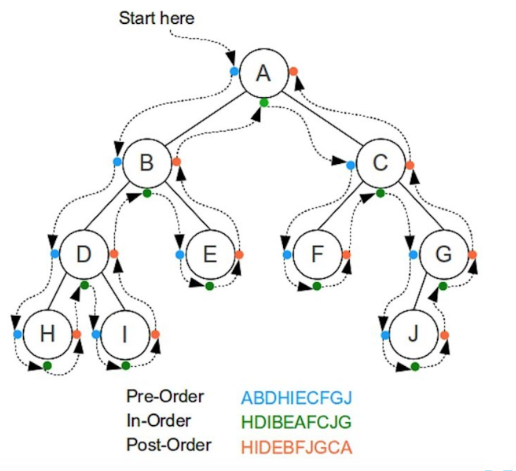

# Arbol
Un árbol es una estructura de datos basada en nodos que busca jerarquizar la información.


|Node|Root|Parent|Child|Brother|Leaf|
|-|-|-|-|-|-|
|Representa cada elemento con la información a almacenar|Es el nodo principal y del que converge todo el arbol|Cada nodo con 1 o más child|Cada nodo que desciende de un nodo anterior|Nodos al mismo nivel| Nodo en el nivel inferior del arbol sin childs|

# Árbol Binario
Un **Árbol binario** es un arbol en donde cada nodo posee de 0 a 2 hijos.
Funciona de manera que dado un nodo, Todos sus childs a su derecha serán menores a él y todos los childs a su izquierda serán mayores.

## Tipos de árboles binarios

### Full binary tree 
Todos los nodos tienen 0 o 2 childs

### Perfect Binary tree
Todas las hojas están al mismo nivel

### Complete binary tree
Todos los niveles están completamente llenos a excepción del último, en donde todas las hojas están hacia la izquierda

### Balance binary tree 
La diferencia de niveles entre los nodos de derecha e izquierda es máximo de 1

# Árbol binario de busqueda
Nos permite operaciones más rápidas con los datos

|Peso|Nivel|Altura|Profundidad|
|-|-|-|-|
|La cantidad de nodos hijos|La cantidad de Parent Nodes desde un Node hasta el Root|La distancia más larga hacia un nodo hoja (un nodo hoja tendrá altura 0). Por tanto la altura de un árbol vacío es -1|El nivel de un nodo|

## Tipos de recorridos 



## Inserción de datos
Realizas una busqueda hasta encontrar un Node null

## Busqueda de datos
``` python
Si node es igual a null entonces el elemento no está  

Si node es mayor al valor buscado
    Anda al sub-arbol izquierdo y repite

Si node es menot al valor buscado
    Anda al sub-arbol derecho y repite

retorna el elemento
      
```

## Eliminación de datos

Buscamos el Node a eliminar y una vez encontrado hay 3 casos

1. Si es una hoja, simplemente eliminamos el elemento
2. Si tiene un solo Child, reemplazamos el lugar del Node con el Child y eliminamos el Node
3. Si tiene dos hijos buscamos su sucesor en In-Order y lo reemplazamos

# BST AVL
Ocupa un espacio de O(n), y tanto su búsqueda,
inserción y borrado toman O(log n) en su caso promedio
y peor.
En el árbol AVL las alturas de los sub-árboles de cada nodo
difieren por un máximo de uno.
- **Altura(H)**: Para un árbol T con v como su raíz. La altura es la
longitud de la ruta más larga de v a una hoja

Para todo nodo **u** su **factor de balanceo (hb)** se
define  _hb(u) = H(Left(u)) - H(Right(u))_

Donde los resultados deben ser {0: balanceado, +1: cargado a la izquierda, -1: cargado a la derecha}

## Inserción
- **Caso 1**: La altura del árbol se mantene y solo se agrega el nuevo nodo.
- **Caso 2**: La álura del árbol crece, pero no hay necesidad de volver a equilibrar. Solo se actualizan las álturas.
- **Caso 3**: Se necesita volver a equilibrar realizando rotaciones simples o dobles.

## Tipos de rotaciones
- **Left Left** Rotación simple a la derecha
- **Left Left** Rotación simple a la derecha
``` bash
Antes:
        Y
       / \
      Z   D
     / \
    X   C
   / \
  A   B


Después de rotación derecha:
        Z
       / \
      X   Y
     / \  / \
    A  B C  D


R_Rota(&Y):
    Z = Y->left = Z->right
    Y->left = Z->right
    Z->right = Y
    Y = Z
```

- **Right Right** Rotación simple a la izquierda

``` bash
Antes:
        Y
       / \
      X   D
     / \
    A   Z
       / \
      B   C


Después de rotación derecha:
        Y
       / \
      X   D
     / \
    A   Z
         \
          B

L_Rota(&X):
    Z = X->right
    X->right = Z->left
    Z->left = X
    X = Z
```

- **Left Right** Rotación izquierda + derecha
```bash
LR_Rota(&Y):
    L_Rota(Y->left)
    R_Rota(Y)
```
- **Right Left** Rotación derecha + izquierda
```bash
RL_Rota(&Y):
    R_Rota(Y->right)
    L_Rota(Y)
```